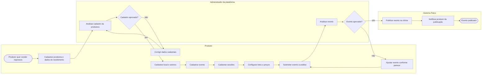

# P1 — Criação e publicação de evento

**Pool:** Plataforma Palco  
**Raias:** Produtor, Administrador da plataforma, Sistema Palco  
**Arquivo BPMN:** [`bpmn/P1-criacao-e-publicacao-de-evento.bpmn`](../../bpmn/P1-criacao-e-publicacao-de-evento.bpmn)

Vai da chegada de uma produtora à plataforma até o evento no ar, pronto para vender. Concentra os cadastros de base, local, evento, sessões e lotes, e passa por duas aprovações do administrador, uma do cadastro da produtora e outra do evento em si. As duas aprovações têm caminho de retorno, porque na prática a maior parte dos eventos volta para ajuste antes de ser publicada.

## Atividades e requisitos atendidos

| Elemento | Tipo | Raia | Requisitos |
|---|---|---|---|
| Produtor quer vender ingressos | Evento de início | Produtor | — |
| Cadastrar produtora e dados de recebimento | Tarefa de usuário | Produtor | RF03 |
| Analisar cadastro da produtora | Tarefa de usuário | Administrador da plataforma | RF03 |
| Cadastro aprovado? | Desvio exclusivo | Administrador da plataforma | — |
| Corrigir dados cadastrais | Tarefa de usuário | Produtor | RF03 |
| Cadastrar local e setores | Tarefa de usuário | Produtor | RF04 |
| Cadastrar evento | Tarefa de usuário | Produtor | RF05 |
| Cadastrar sessões | Tarefa de usuário | Produtor | RF06 |
| Configurar lotes e preços | Tarefa de usuário | Produtor | RF07 |
| Submeter evento à análise | Tarefa de usuário | Produtor | RF08 |
| Analisar evento | Tarefa de usuário | Administrador da plataforma | RF08 |
| Evento aprovado? | Desvio exclusivo | Administrador da plataforma | — |
| Ajustar evento conforme parecer | Tarefa de usuário | Produtor | RF08 |
| Publicar evento na vitrine | Tarefa de sistema | Sistema Palco | RF08, RF09 |
| Notificar produtor da publicação | Tarefa de sistema | Sistema Palco | RF24 |
| Evento publicado | Evento de fim | Sistema Palco | — |

## Fluxo

