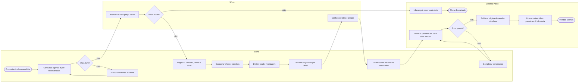

# P1 — Planejamento do show e abertura de vendas

**Pool:** Cena Livre  
**Raias:** Dono, Sócio, Sistema Palco  
**Arquivo BPMN:** [`bpmn/P1-planejamento-e-abertura-de-vendas.bpmn`](../../bpmn/P1-planejamento-e-abertura-de-vendas.bpmn)

Vai da proposta de uma banda até a venda aberta em todos os canais. Nasce da queixa do dono de que a agenda fica num caderno e de que a divisão de ingressos entre Instagram, loja parceira e porta é feita no chute. Por isso a data é pré-reservada antes da negociação do cachê, e a venda só abre depois que o sistema confirma contrato, montagem, cotas por canal e lotes. O sócio aparece em raia própria porque é ele quem decide cachê e preço.

## Atividades e requisitos atendidos

| Elemento | Tipo | Raia | Requisitos |
|---|---|---|---|
| Proposta de show recebida | Evento de início | Dono | — |
| Consultar agenda e pré-reservar data | Tarefa de usuário | Dono | RF26 |
| Data livre? | Desvio exclusivo | Dono | — |
| Propor outra data à banda | Tarefa de usuário | Dono | RF26 |
| Avaliar cachê e preço viável | Tarefa de usuário | Sócio | RF20 |
| Show viável? | Desvio exclusivo | Sócio | — |
| Liberar pré-reserva da data | Tarefa de sistema | Sistema Palco | RF26 |
| Show descartado | Evento de fim | Sistema Palco | — |
| Registrar contrato, cachê e sinal | Tarefa de usuário | Dono | RF20, RF33 |
| Cadastrar show e sessões | Tarefa de usuário | Dono | RF05, RF06, RF26 |
| Definir local e montagem | Tarefa de usuário | Dono | RF04 |
| Distribuir ingressos por canal | Tarefa de usuário | Dono | RF27 |
| Configurar lotes e preços | Tarefa de usuário | Sócio | RF07 |
| Definir cotas da lista de convidados | Tarefa de usuário | Dono | RF28 |
| Verificar pendências para abrir vendas | Tarefa de sistema | Sistema Palco | RF08 |
| Tudo pronto? | Desvio exclusivo | Sistema Palco | — |
| Completar pendências | Tarefa de usuário | Dono | RF08 |
| Publicar página de vendas do show | Tarefa de sistema | Sistema Palco | RF08, RF09 |
| Liberar cotas à loja parceira e à bilheteria | Tarefa de sistema | Sistema Palco | RF27, RF29, RF24 |
| Vendas abertas | Evento de fim | Sistema Palco | — |

## Fluxo

