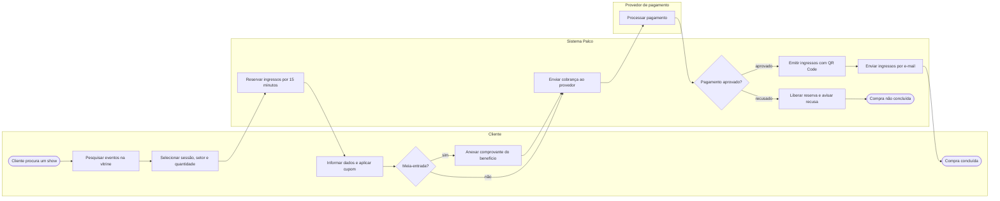

# P2 — Venda de ingresso online

**Pool:** Bilheteria Palco  
**Raias:** Cliente, Sistema Palco, Provedor de pagamento  
**Arquivo BPMN:** [`bpmn/P2-venda-de-ingresso-online.bpmn`](../../bpmn/P2-venda-de-ingresso-online.bpmn)

É o processo de maior volume do sistema e o que sustenta a receita. A reserva temporária existe para impedir que dois compradores fechem o mesmo assento e, ao mesmo tempo, para devolver o estoque quando a compra é abandonada no meio. O provedor de pagamento aparece como raia própria porque é um ator externo, com tempo de resposta fora do controle da equipe.

## Atividades e requisitos atendidos

| Elemento | Tipo | Raia | Requisitos |
|---|---|---|---|
| Cliente procura um show | Evento de início | Cliente | — |
| Pesquisar eventos na vitrine | Tarefa de usuário | Cliente | RF09 |
| Selecionar sessão, setor e quantidade | Tarefa de usuário | Cliente | RF10 |
| Reservar ingressos por 15 minutos | Tarefa de sistema | Sistema Palco | RF10 |
| Informar dados e aplicar cupom | Tarefa de usuário | Cliente | RF11, RF14 |
| Meia-entrada? | Desvio exclusivo | Cliente | — |
| Anexar comprovante do benefício | Tarefa de usuário | Cliente | RF13 |
| Enviar cobrança ao provedor | Tarefa de sistema | Sistema Palco | RF11 |
| Processar pagamento | Tarefa de sistema | Provedor de pagamento | RF11 |
| Pagamento aprovado? | Desvio exclusivo | Sistema Palco | — |
| Emitir ingressos com QR Code | Tarefa de sistema | Sistema Palco | RF12 |
| Liberar reserva e avisar recusa | Tarefa de sistema | Sistema Palco | RF10, RF24 |
| Enviar ingressos por e-mail | Tarefa de sistema | Sistema Palco | RF24 |
| Compra não concluída | Evento de fim | Sistema Palco | — |
| Compra concluída | Evento de fim | Cliente | — |

## Fluxo

