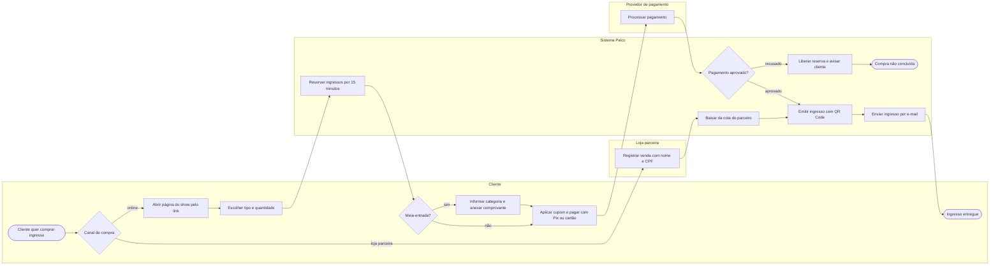

# P2 — Venda de ingressos nos canais

**Pool:** Bilheteria Cena Livre  
**Raias:** Cliente, Loja parceira, Sistema Palco, Provedor de pagamento  
**Arquivo BPMN:** [`bpmn/P2-venda-de-ingressos-nos-canais.bpmn`](../../bpmn/P2-venda-de-ingressos-nos-canais.bpmn)

Reúne num único estoque os dois canais que vendem antes do dia do show: a página de vendas divulgada no Instagram e a loja parceira. Na entrevista, o comprovante chegava como print no WhatsApp e a loja informava as vendas dias depois. Aqui o pagamento online é confirmado pelo provedor, sem print, e a loja registra cada venda na hora, com nome e CPF, baixando da própria cota. Os dois caminhos terminam no mesmo ingresso com QR Code.

## Atividades e requisitos atendidos

| Elemento | Tipo | Raia | Requisitos |
|---|---|---|---|
| Cliente quer comprar ingresso | Evento de início | Cliente | — |
| Canal de compra | Desvio exclusivo | Cliente | — |
| Abrir página do show pelo link | Tarefa de usuário | Cliente | RF09 |
| Registrar venda com nome e CPF | Tarefa de usuário | Loja parceira | RF29 |
| Baixar da cota do parceiro | Tarefa de sistema | Sistema Palco | RF27, RF29 |
| Escolher tipo e quantidade | Tarefa de usuário | Cliente | RF10 |
| Reservar ingressos por 15 minutos | Tarefa de sistema | Sistema Palco | RF10, RF27 |
| Meia-entrada? | Desvio exclusivo | Cliente | — |
| Informar categoria e anexar comprovante | Tarefa de usuário | Cliente | RF13 |
| Aplicar cupom e pagar com Pix ou cartão | Tarefa de usuário | Cliente | RF11, RF14 |
| Processar pagamento | Tarefa de sistema | Provedor de pagamento | RF11 |
| Pagamento aprovado? | Desvio exclusivo | Sistema Palco | — |
| Liberar reserva e avisar cliente | Tarefa de sistema | Sistema Palco | RF10, RF24 |
| Compra não concluída | Evento de fim | Sistema Palco | — |
| Emitir ingresso com QR Code | Tarefa de sistema | Sistema Palco | RF12 |
| Enviar ingresso por e-mail | Tarefa de sistema | Sistema Palco | RF12, RF24 |
| Ingresso entregue | Evento de fim | Cliente | — |

## Fluxo

