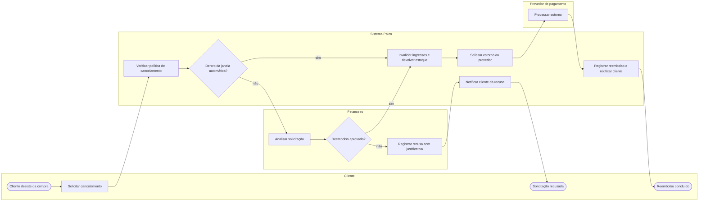

# P3 — Cancelamento e reembolso

**Pool:** Pós-venda Palco  
**Raias:** Cliente, Sistema Palco, Financeiro, Provedor de pagamento  
**Arquivo BPMN:** [`bpmn/P3-cancelamento-e-reembolso.bpmn`](../../bpmn/P3-cancelamento-e-reembolso.bpmn)

Separa o que pode ser resolvido por regra do que precisa de decisão humana. Dentro da janela de sete dias e a mais de quarenta e oito horas da sessão, o cancelamento é automático. Fora dela, o financeiro analisa e pode recusar com justificativa. Nos dois caminhos o ingresso é invalidado antes de qualquer estorno, para não abrir a porta de usar o ingresso e receber o dinheiro de volta.

## Atividades e requisitos atendidos

| Elemento | Tipo | Raia | Requisitos |
|---|---|---|---|
| Cliente desiste da compra | Evento de início | Cliente | — |
| Solicitar cancelamento | Tarefa de usuário | Cliente | RF15 |
| Verificar política de cancelamento | Tarefa de sistema | Sistema Palco | RF15 |
| Dentro da janela automática? | Desvio exclusivo | Sistema Palco | — |
| Analisar solicitação | Tarefa de usuário | Financeiro | RF15 |
| Reembolso aprovado? | Desvio exclusivo | Financeiro | — |
| Registrar recusa com justificativa | Tarefa de usuário | Financeiro | RF15 |
| Invalidar ingressos e devolver estoque | Tarefa de sistema | Sistema Palco | RF15, RF12 |
| Notificar cliente da recusa | Tarefa de sistema | Sistema Palco | RF24 |
| Solicitar estorno ao provedor | Tarefa de sistema | Sistema Palco | RF15 |
| Processar estorno | Tarefa de sistema | Provedor de pagamento | RF15 |
| Solicitação recusada | Evento de fim | Cliente | — |
| Registrar reembolso e notificar cliente | Tarefa de sistema | Sistema Palco | RF22, RF24 |
| Reembolso concluído | Evento de fim | Cliente | — |

## Fluxo

