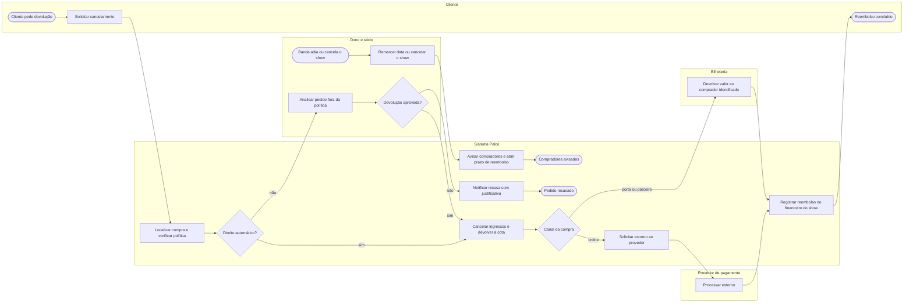

# P3 — Cancelamento, remarcação e reembolso

**Pool:** Pós-venda Cena Livre  
**Raias:** Cliente, Dono e sócio, Bilheteria, Sistema Palco, Provedor de pagamento  
**Arquivo BPMN:** [`bpmn/P3-cancelamento-remarcacao-e-reembolso.bpmn`](../../bpmn/P3-cancelamento-remarcacao-e-reembolso.bpmn)

Tem dois gatilhos. O cliente que desiste da compra e a banda que adia ou cancela o show, situação relatada pelo dono. Na remarcação o sistema avisa todos os compradores e abre um prazo em que a devolução é automática. A devolução segue o canal de origem: estorno pelo provedor para compras online e devolução pela bilheteria ou pela loja para as demais, sempre para o comprador identificado na venda, o que evita devolver à pessoa errada.

## Atividades e requisitos atendidos

| Elemento | Tipo | Raia | Requisitos |
|---|---|---|---|
| Cliente pede devolução | Evento de início | Cliente | — |
| Banda adia ou cancela o show | Evento de início | Dono e sócio | — |
| Remarcar data ou cancelar o show | Tarefa de usuário | Dono e sócio | RF31, RF26 |
| Avisar compradores e abrir prazo de reembolso | Tarefa de sistema | Sistema Palco | RF31, RF24 |
| Compradores avisados | Evento de fim | Sistema Palco | — |
| Solicitar cancelamento | Tarefa de usuário | Cliente | RF15 |
| Localizar compra e verificar política | Tarefa de sistema | Sistema Palco | RF15 |
| Direito automático? | Desvio exclusivo | Sistema Palco | — |
| Analisar pedido fora da política | Tarefa de usuário | Dono e sócio | RF15 |
| Devolução aprovada? | Desvio exclusivo | Dono e sócio | — |
| Notificar recusa com justificativa | Tarefa de sistema | Sistema Palco | RF15, RF24 |
| Pedido recusado | Evento de fim | Sistema Palco | — |
| Cancelar ingressos e devolver à cota | Tarefa de sistema | Sistema Palco | RF15, RF12, RF27 |
| Canal da compra | Desvio exclusivo | Sistema Palco | — |
| Solicitar estorno ao provedor | Tarefa de sistema | Sistema Palco | RF15 |
| Processar estorno | Tarefa de sistema | Provedor de pagamento | RF15 |
| Devolver valor ao comprador identificado | Tarefa de usuário | Bilheteria | RF15, RF29, RF30 |
| Registrar reembolso no financeiro do show | Tarefa de sistema | Sistema Palco | RF22, RF24 |
| Reembolso concluído | Evento de fim | Cliente | — |

## Fluxo

