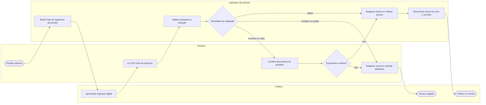

# P4 — Check-in e controle de acesso

**Pool:** Portaria do evento  
**Raias:** Público, Portaria, Aplicativo de portaria  
**Arquivo BPMN:** [`bpmn/P4-checkin-e-controle-de-acesso.bpmn`](../../bpmn/P4-checkin-e-controle-de-acesso.bpmn)

Roda no dia do evento, sob pressão de fila e com rede instável. A validação acontece no próprio aparelho, contra a lista baixada antes da abertura dos portões, e a sincronização com o servidor é posterior. O desvio de três saídas reflete o que o operador vê na tela: libera, nega ou confere documento.

## Atividades e requisitos atendidos

| Elemento | Tipo | Raia | Requisitos |
|---|---|---|---|
| Portões abertos | Evento de início | Portaria | — |
| Baixar lista de ingressos da sessão | Tarefa de sistema | Aplicativo de portaria | RF18 |
| Apresentar ingresso digital | Tarefa manual | Público | RF12 |
| Ler QR Code do ingresso | Tarefa de usuário | Portaria | RF17 |
| Validar assinatura e situação | Tarefa de sistema | Aplicativo de portaria | RF17, RF12 |
| Resultado da validação | Desvio exclusivo | Aplicativo de portaria | — |
| Conferir documento do portador | Tarefa de usuário | Portaria | RF13, RF16 |
| Documento confere? | Desvio exclusivo | Portaria | — |
| Registrar check-in e liberar acesso | Tarefa de sistema | Aplicativo de portaria | RF17 |
| Registrar recusa e orientar bilheteria | Tarefa de usuário | Portaria | RF17 |
| Sincronizar check-ins com o servidor | Tarefa de sistema | Aplicativo de portaria | RF18 |
| Acesso negado | Evento de fim | Público | — |
| Público no evento | Evento de fim | Público | — |

## Fluxo

