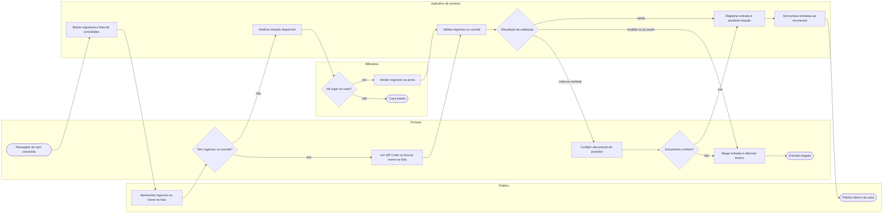

# P4 — Entrada do público no dia do show

**Pool:** Portaria Cena Livre  
**Raias:** Público, Portaria, Bilheteria, Aplicativo de portaria  
**Arquivo BPMN:** [`bpmn/P4-entrada-do-publico-no-dia-do-show.bpmn`](../../bpmn/P4-entrada-do-publico-no-dia-do-show.bpmn)

Roda na porta da casa, sob fila e com internet instável. O aplicativo baixa ingressos e lista de convidados antes da abertura e valida sem rede. Quem chega sem ingresso só compra na porta se ainda houver lugar, porque a lotação é contada a cada entrada, resposta direta ao episódio em que a casa lotou com gente de ingresso na mão. O desvio de três saídas reflete o que o porteiro vê: libera, nega ou confere documento.

## Atividades e requisitos atendidos

| Elemento | Tipo | Raia | Requisitos |
|---|---|---|---|
| Passagem de som concluída | Evento de início | Portaria | — |
| Baixar ingressos e lista de convidados | Tarefa de sistema | Aplicativo de portaria | RF18, RF28 |
| Apresentar ingresso ou nome na lista | Tarefa manual | Público | RF12, RF28 |
| Tem ingresso ou convite? | Desvio exclusivo | Portaria | — |
| Ler QR Code ou buscar nome na lista | Tarefa de usuário | Portaria | RF17, RF28 |
| Verificar lotação disponível | Tarefa de sistema | Aplicativo de portaria | RF32 |
| Há lugar na casa? | Desvio exclusivo | Bilheteria | — |
| Vender ingresso na porta | Tarefa de usuário | Bilheteria | RF30, RF12 |
| Casa lotada | Evento de fim | Bilheteria | — |
| Validar ingresso ou convite | Tarefa de sistema | Aplicativo de portaria | RF17, RF18 |
| Resultado da validação | Desvio exclusivo | Aplicativo de portaria | — |
| Conferir documento do portador | Tarefa de usuário | Portaria | RF13, RF16 |
| Documento confere? | Desvio exclusivo | Portaria | — |
| Registrar entrada e atualizar lotação | Tarefa de sistema | Aplicativo de portaria | RF17, RF32 |
| Negar entrada e informar motivo | Tarefa de usuário | Portaria | RF17 |
| Sincronizar entradas ao reconectar | Tarefa de sistema | Aplicativo de portaria | RF18 |
| Entrada negada | Evento de fim | Portaria | — |
| Público dentro da casa | Evento de fim | Público | — |

## Fluxo

