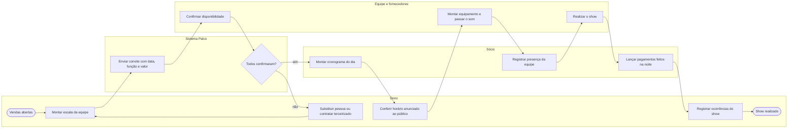

# P5 — Produção do show

**Pool:** Produção Cena Livre  
**Raias:** Dono, Sócio, Equipe e fornecedores, Sistema Palco  
**Arquivo BPMN:** [`bpmn/P5-producao-do-show.bpmn`](../../bpmn/P5-producao-do-show.bpmn)

Cobre a equipe e o dia do show. Hoje a escala é combinada por mensagem e há quem esqueça o compromisso, então o convite sai pelo sistema e cada pessoa confirma, com laço de substituição quando alguém não confirma. Os pagamentos feitos em dinheiro durante a noite são lançados no mesmo dia, para não se perderem até o fechamento.

## Atividades e requisitos atendidos

| Elemento | Tipo | Raia | Requisitos |
|---|---|---|---|
| Vendas abertas | Evento de início | Dono | — |
| Montar escala da equipe | Tarefa de usuário | Dono | RF19 |
| Enviar convite com data, função e valor | Tarefa de sistema | Sistema Palco | RF19, RF24 |
| Confirmar disponibilidade | Tarefa de usuário | Equipe e fornecedores | RF19 |
| Todos confirmaram? | Desvio exclusivo | Sistema Palco | — |
| Substituir pessoa ou contratar terceirizado | Tarefa de usuário | Dono | RF19, RF20 |
| Montar cronograma do dia | Tarefa de usuário | Sócio | RF21 |
| Conferir horário anunciado ao público | Tarefa de usuário | Dono | RF21, RF24 |
| Montar equipamento e passar o som | Tarefa manual | Equipe e fornecedores | RF21 |
| Registrar presença da equipe | Tarefa de usuário | Sócio | RF19 |
| Realizar o show | Tarefa manual | Equipe e fornecedores | RF21 |
| Lançar pagamentos feitos na noite | Tarefa de usuário | Sócio | RF33 |
| Registrar ocorrências do show | Tarefa de usuário | Dono | RF23 |
| Show realizado | Evento de fim | Dono | — |

## Fluxo

