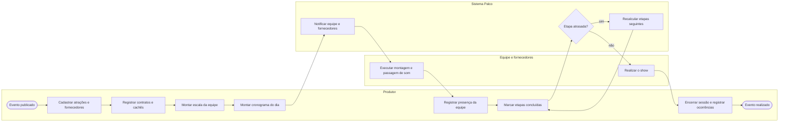

# P5 — Produção e realização do evento

**Pool:** Produção do evento  
**Raias:** Produtor, Equipe e fornecedores, Sistema Palco  
**Arquivo BPMN:** [`bpmn/P5-producao-e-realizacao-do-evento.bpmn`](../../bpmn/P5-producao-e-realizacao-do-evento.bpmn)

Cobre a operação em torno do show, do fechamento das atrações à execução do dia. O laço sobre o cronograma é a parte mais usada na prática, porque atraso de passagem de som empurra todo o resto e a produção precisa ver o efeito na hora.

## Atividades e requisitos atendidos

| Elemento | Tipo | Raia | Requisitos |
|---|---|---|---|
| Evento publicado | Evento de início | Produtor | — |
| Cadastrar atrações e fornecedores | Tarefa de usuário | Produtor | RF20 |
| Registrar contratos e cachês | Tarefa de usuário | Produtor | RF20 |
| Montar escala da equipe | Tarefa de usuário | Produtor | RF19 |
| Montar cronograma do dia | Tarefa de usuário | Produtor | RF21 |
| Notificar equipe e fornecedores | Tarefa de sistema | Sistema Palco | RF24 |
| Executar montagem e passagem de som | Tarefa manual | Equipe e fornecedores | RF21 |
| Registrar presença da equipe | Tarefa de usuário | Produtor | RF19 |
| Marcar etapas concluídas | Tarefa de usuário | Produtor | RF21 |
| Etapa atrasada? | Desvio exclusivo | Sistema Palco | — |
| Recalcular etapas seguintes | Tarefa de sistema | Sistema Palco | RF21 |
| Realizar o show | Tarefa manual | Equipe e fornecedores | RF21 |
| Encerrar sessão e registrar ocorrências | Tarefa de usuário | Produtor | RF23 |
| Evento realizado | Evento de fim | Produtor | — |

## Fluxo

