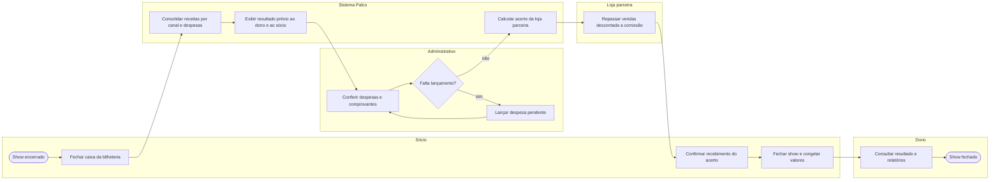

# P6 — Fechamento financeiro do show

**Pool:** Financeiro Cena Livre  
**Raias:** Dono, Sócio, Administrativo, Loja parceira, Sistema Palco  
**Arquivo BPMN:** [`bpmn/P6-fechamento-financeiro-do-show.bpmn`](../../bpmn/P6-fechamento-financeiro-do-show.bpmn)

Substitui a reunião na cozinha do sócio, dias depois do show, com caderno e recibos. Logo após o fechamento do caixa da porta o sistema mostra um resultado prévio, a terceira prioridade do dono. O fechamento definitivo espera a conferência das despesas e o acerto da loja parceira, que repassa as vendas descontada a comissão combinada.

## Atividades e requisitos atendidos

| Elemento | Tipo | Raia | Requisitos |
|---|---|---|---|
| Show encerrado | Evento de início | Sócio | — |
| Fechar caixa da bilheteria | Tarefa de usuário | Sócio | RF30, RF33 |
| Consolidar receitas por canal e despesas | Tarefa de sistema | Sistema Palco | RF22, RF33 |
| Exibir resultado prévio ao dono e ao sócio | Tarefa de sistema | Sistema Palco | RF22 |
| Conferir despesas e comprovantes | Tarefa de usuário | Administrativo | RF33 |
| Falta lançamento? | Desvio exclusivo | Administrativo | — |
| Lançar despesa pendente | Tarefa de usuário | Administrativo | RF33 |
| Calcular acerto da loja parceira | Tarefa de sistema | Sistema Palco | RF29 |
| Repassar vendas descontada a comissão | Tarefa de usuário | Loja parceira | RF29 |
| Confirmar recebimento do acerto | Tarefa de usuário | Sócio | RF29, RF22 |
| Fechar show e congelar valores | Tarefa de usuário | Sócio | RF22 |
| Consultar resultado e relatórios | Tarefa de usuário | Dono | RF23 |
| Show fechado | Evento de fim | Dono | — |

## Fluxo

