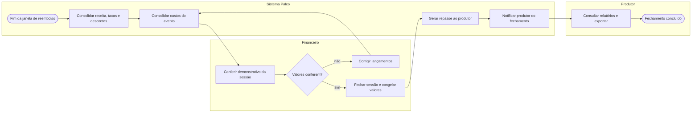

# P6 — Fechamento financeiro e repasse

**Pool:** Financeiro Palco  
**Raias:** Sistema Palco, Financeiro, Produtor  
**Arquivo BPMN:** [`bpmn/P6-fechamento-financeiro-e-repasse.bpmn`](../../bpmn/P6-fechamento-financeiro-e-repasse.bpmn)

Começa por tempo, e não por ação de usuário, quando encerra a janela de reembolso da sessão. Essa espera é deliberada: fechar antes significaria repassar ao produtor dinheiro que ainda pode ser estornado. O laço de correção devolve o fluxo à consolidação de custos, que é onde os erros de lançamento aparecem.

## Atividades e requisitos atendidos

| Elemento | Tipo | Raia | Requisitos |
|---|---|---|---|
| Fim da janela de reembolso | Evento de início por tempo | Sistema Palco | — |
| Consolidar receita, taxas e descontos | Tarefa de sistema | Sistema Palco | RF22 |
| Consolidar custos do evento | Tarefa de sistema | Sistema Palco | RF22, RF19, RF20 |
| Conferir demonstrativo da sessão | Tarefa de usuário | Financeiro | RF22 |
| Valores conferem? | Desvio exclusivo | Financeiro | — |
| Corrigir lançamentos | Tarefa de usuário | Financeiro | RF22 |
| Fechar sessão e congelar valores | Tarefa de usuário | Financeiro | RF22 |
| Gerar repasse ao produtor | Tarefa de sistema | Sistema Palco | RF22, RF03 |
| Notificar produtor do fechamento | Tarefa de sistema | Sistema Palco | RF24 |
| Consultar relatórios e exportar | Tarefa de usuário | Produtor | RF23 |
| Fechamento concluído | Evento de fim | Produtor | — |

## Fluxo

